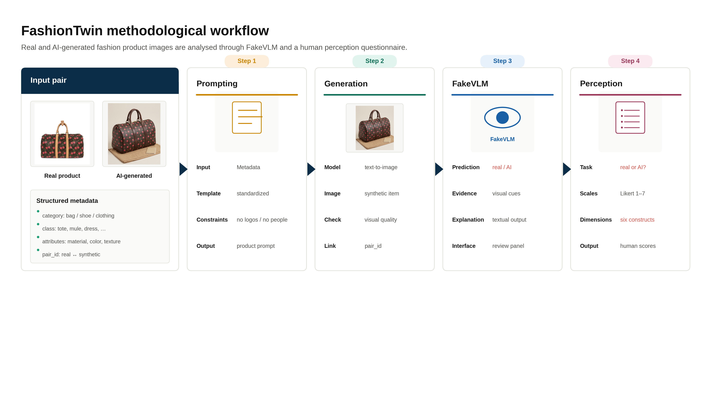
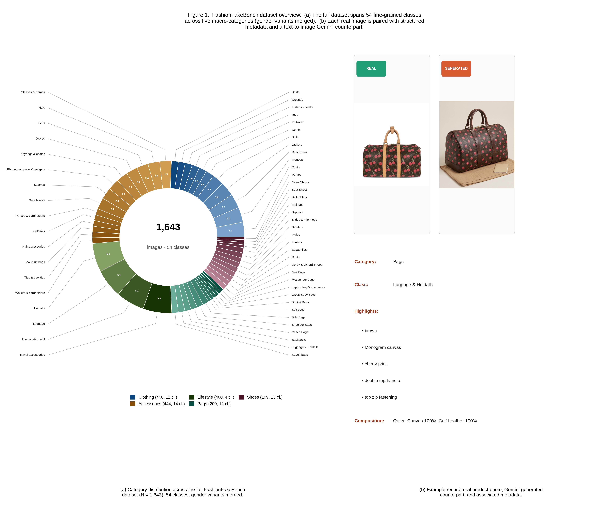
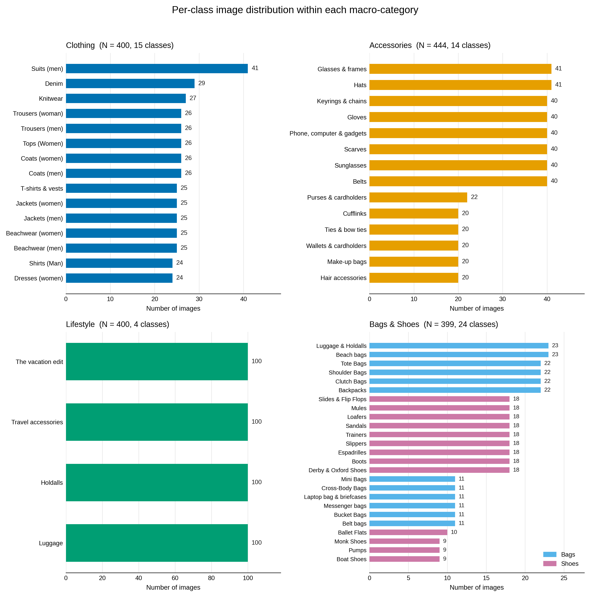

<div align="center">

# FashionTwin
### A Paired Dataset of Real and AI-Generated Fashion Product Images

[](#license)
[-blue.svg)](#dataset-statistics)
[](#dataset-statistics)

[Dataset Statistics](#dataset-statistics) • [Download](#download) • [Dataset Structure](#dataset-structure) • [Annotation Protocol](#perceptual-annotation-protocol) • [License](#license)

</div>

> **Note on image previews:** if the figures below don't render on your Git host, make sure the `assets/` folder was committed/pushed alongside this `README.md` — GitHub resolves `assets/xxx.png` as a path relative to the README's location in the repo, so the images only show up once that folder actually exists at the same level. If you renamed or moved the folder, update the paths below to match.

---

## Overview

**FashionTwin** is a paired benchmark of **1,643 real fashion product images** and their **AI-generated counterparts**, built to study the visual and perceptual differences between real e-commerce photography and synthetic fashion imagery.

Every real image comes with structured metadata — macro-category, fine-grained class, textual highlights, and material composition — which was used, through a standardised prompting protocol, to generate a paired synthetic version with a text-to-image model. The generation prompts deliberately exclude brand references, people, and environmental scenes, so that each pair can be compared on visual and material attributes alone.

<p align="center">
  
</p>

<p align="center"><sub><b>Figure 1.</b> How each pair is built: a real product image and its metadata are turned into a standardised prompt, which generates the AI counterpart.</sub></p>

---

## Dataset Statistics

FashionTwin contains **1,643 real product images**, organised into **5 macro-categories** and **54 fine-grained classes**, each paired 1:1 with an AI-generated counterpart (**3,286 images in total**).

| Macro-category | Images | Classes |
|---|---:|---:|
| Accessories | 444 | 14 |
| Clothing | 400 | 11 |
| Lifestyle | 400 | 4 |
| Bags | 200 | 12 |
| Shoes | 199 | 13 |
| **Total** | **1,643** | **54** |

<p align="center">
  
</p>

<p align="center"><sub><b>Figure 2.</b> (a) Distribution of the 1,643 real images across all 54 fine-grained classes and 5 macro-categories. (b) Example of a real–AI-generated pair sharing the same category, class, highlights, and material composition.</sub></p>

<p align="center">
  
</p>

<p align="center"><sub><b>Figure 3.</b> Per-class image counts within each of the five macro-categories.</sub></p>

Each real image is annotated with the following metadata fields, which are also the fields used to build the generation prompt:

| Field | Description |
|---|---|
| `image_id` | Unique image identifier |
| `pair_id` | Identifier linking the real image to its AI-generated counterpart |
| `macro_category` | One of: Clothing, Accessories, Lifestyle, Bags, Shoes |
| `class` | Fine-grained product class (e.g. Tote Bags, Derby & Oxford Shoes, ...) |
| `highlights` | Short textual tags describing shape, colour, pattern, and notable details |
| `composition` | Material composition (e.g. "Outer: Canvas 100%, Calf Leather 100%") |
| `source_id` | Reference to the original e-commerce listing |

---

## Download

> **Note:** replace the placeholders below with your actual hosting links (e.g. Hugging Face Datasets, Zenodo, institutional storage) before publishing.

| Asset | Size | Link |
|---|---|---|
| Real images (1,643) | TBD | [`download`](#) |
| AI-generated images (1,643) | TBD | [`download`](#) |
| Metadata (`metadata.csv`) | TBD | [`download`](#) |

```bash
# Example: once hosted, a simple download script could look like this
wget <REAL_IMAGES_URL> -O fashiontwin_real.zip
wget <GENERATED_IMAGES_URL> -O fashiontwin_generated.zip
wget <METADATA_URL> -O metadata.csv
unzip fashiontwin_real.zip -d data/real
unzip fashiontwin_generated.zip -d data/generated
```

---

## Dataset Structure

```
FashionTwin/
├── data/
│   ├── real/
│   │   ├── clothing/
│   │   ├── accessories/
│   │   ├── lifestyle/
│   │   ├── bags/
│   │   └── shoes/
│   └── generated/
│       ├── clothing/
│       ├── accessories/
│       ├── lifestyle/
│       ├── bags/
│       └── shoes/
├── metadata.csv
└── README.md
```

`metadata.csv` follows the schema described in [Dataset Statistics](#dataset-statistics); `image_id` and `pair_id` are the keys used to join real images with their generated counterparts.

---

## Perceptual Annotation Protocol

Alongside the images, FashionTwin includes an optional set of human perceptual ratings collected for a subset of the images, using a questionnaire grounded in empirical aesthetics. Each image can be rated on six 7-point Likert-scale dimensions:

| Construct | Question | Response scale |
|---|---|---|
| Real/Fake detection | Do you think this image is real or AI-generated? | Real / AI-generated / I do not know |
| Confidence | How confident are you in your answer? | 1 (not confident) – 7 (very confident) |
| Beauty | How beautiful do you find this image? | 1 (not beautiful) – 7 (very beautiful) |
| Complexity | How complex or elaborate does this image appear? | 1 (not complex) – 7 (very complex) |
| Realism | How realistic does this image appear? | 1 (not realistic) – 7 (very realistic) |
| Perceived effort | How much work or effort do you think was required to create this image? | 1 (very little effort) – 7 (very high effort) |
| Authenticity | How authentic does this image appear? | 1 (not authentic) – 7 (very authentic) |
| Interest | How interesting do you find this image? | 1 (not interesting) – 7 (very interesting) |
| Qualitative cues | Which visual elements influenced your real/AI judgment? | Open-ended answer |

This protocol is not exclusive to FashionTwin — it can be reused to collect comparable ratings on other real/AI-generated image sets.

---

## Usage

```python
import pandas as pd
from PIL import Image

metadata = pd.read_csv("metadata.csv")
row = metadata.iloc[0]

real_img = Image.open(f"data/real/{row.macro_category.lower()}/{row.image_id}.jpg")
gen_img  = Image.open(f"data/generated/{row.macro_category.lower()}/{row.image_id}.jpg")

print(row['class'], row.highlights, row.composition)
```

---

## Ethical Considerations

- Real images were sourced from a public online fashion catalogue for research purposes; brand-identifying references (logos, brand names) were deliberately excluded from the generation prompts to keep the comparison focused on visual and material attributes rather than brand identity.
- AI-generated images were checked to exclude people, models, and environmental scenes, and are not intended to depict or impersonate any real product, brand, or individual.
- This dataset is released for **non-commercial research purposes** (synthetic image detection, empirical aesthetics, human-AI perception studies). It must not be used to create or distribute counterfeit product listings.

---

## License

This dataset is released under **[CC BY-NC 4.0](https://creativecommons.org/licenses/by-nc/4.0/)** — replace with your institution's preferred license before release.

---

## Acknowledgments

The perceptual annotation protocol builds on the multidimensional framework for evaluating AI-generated visual products proposed by Bianchi, Branchini, Uricchio and Bongelli (2025), *"Creativity and aesthetic evaluation of AI-generated artworks: bridging problems and methods from psychology to AI"*, Frontiers in Psychology.

---

## Contact

For questions about the dataset, please open an issue in this repository.
