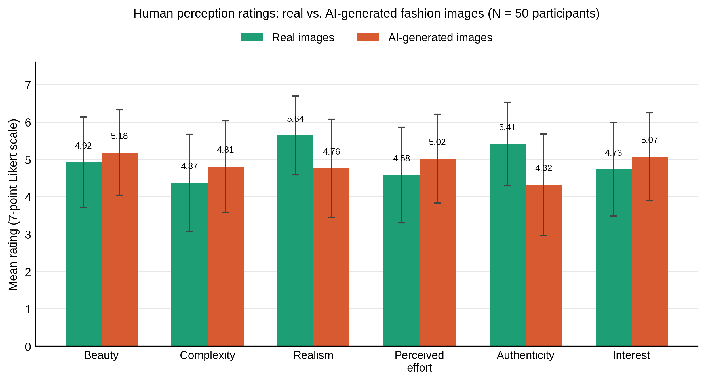

<div align="center">

# FashionTwin
### A Holistic Benchmark for the Perception of AI-Generated Images in Fashion

[](#citation)
[](#license)
[-blue.svg)](#dataset-statistics)
[](#dataset-statistics)

[Paper](#citation) • [Dataset Statistics](#dataset-statistics) • [Download](#download) • [Dataset Structure](#dataset-structure) • [Baselines](#baselines-and-results) • [Citation](#citation)

</div>

---

## Overview

**FashionTwin** is a paired benchmark of **1,643 real fashion product images** and their **AI-generated counterparts**, built to study how well both machines and humans can tell real e-commerce photography apart from synthetic imagery — and, more importantly, *how differently the two are perceived*.

Every real image comes with structured metadata (macro-category, fine-grained class, textual highlights, material composition) that was used, via a standardised prompting protocol, to generate a paired synthetic version with a text-to-image model. Each pair is then run through two complementary evaluations:

- an **explainable automatic detector** ([FakeVLM](https://arxiv.org/abs/2503.14905)), which predicts real/AI and produces a natural-language explanation of the visual cues behind its decision;
- a **human perception study** with 50 non-expert participants, who rate every image on six perceptual dimensions grounded in empirical aesthetics — **beauty, complexity, realism, perceived effort, authenticity, and interest** — following the framework proposed by [Bianchi et al. (2025)](#citation).

FashionTwin is designed to move the conversation beyond binary real/fake classification, toward a richer, human-centred understanding of how synthetic fashion imagery is experienced.

<p align="center">
  
</p>

<p align="center"><sub><b>Figure 1.</b> The FashionTwin pipeline: real–AI-generated pairs with structured metadata are analysed through FakeVLM (automatic detection + explanation) and a human perception questionnaire.</sub></p>

---

## Dataset Statistics

FashionTwin contains **1,643 real product images**, organised into **5 macro-categories** and **54 fine-grained classes**, each paired 1:1 with an AI-generated counterpart (**3,286 images in total**).

| Macro-category | Images | Classes |
|---|---:|---:|
| Accessories | 444 | 14 |
| Clothing | 400 | 11 |
| Lifestyle | 400 | 4 |
| Bags | 200 | 12 |
| Shoes | 199 | 13 |
| **Total** | **1,643** | **54** |

<p align="center">
  
</p>

<p align="center"><sub><b>Figure 2.</b> (a) Distribution of the 1,643 real images across all 54 fine-grained classes and 5 macro-categories. (b) Example of a real–AI-generated pair sharing the same category, class, highlights and material composition.</sub></p>

Each real image is annotated with the following metadata fields, which are also the fields used to build the generation prompt:

| Field | Description |
|---|---|
| `image_id` | Unique image identifier |
| `pair_id` | Identifier linking the real image to its AI-generated counterpart |
| `macro_category` | One of: Clothing, Accessories, Lifestyle, Bags, Shoes |
| `class` | Fine-grained product class (e.g. Tote Bags, Derby & Oxford Shoes, ...) |
| `highlights` | Short textual tags describing shape, colour, pattern, and notable details |
| `composition` | Material composition (e.g. "Outer: Canvas 100%, Calf Leather 100%") |
| `source_id` | Reference to the original e-commerce listing |

---

## Download

> **Note:** replace the placeholders below with your actual hosting links (e.g. Hugging Face Datasets, Zenodo, institutional storage) before publishing.

| Asset | Size | Link |
|---|---|---|
| Real images (1,643) | TBD | [`download`](#) |
| AI-generated images (1,643) | TBD | [`download`](#) |
| Metadata (`metadata.csv`) | TBD | [`download`](#) |
| FakeVLM outputs (`fakevlm_results.csv`) | TBD | [`download`](#) |
| Human perception ratings (`perception_ratings.csv`) | TBD | [`download`](#) |

```bash
# Example: once hosted, a simple download script could look like this
wget <REAL_IMAGES_URL> -O fashiontwin_real.zip
wget <GENERATED_IMAGES_URL> -O fashiontwin_generated.zip
wget <METADATA_URL> -O metadata.csv
unzip fashiontwin_real.zip -d data/real
unzip fashiontwin_generated.zip -d data/generated
```

---

## Dataset Structure

```
FashionTwin/
├── data/
│   ├── real/
│   │   ├── clothing/
│   │   ├── accessories/
│   │   ├── lifestyle/
│   │   ├── bags/
│   │   └── shoes/
│   └── generated/
│       ├── clothing/
│       ├── accessories/
│       ├── lifestyle/
│       ├── bags/
│       └── shoes/
├── metadata.csv
├── fakevlm_results.csv
├── perception_ratings.csv
└── README.md
```

`metadata.csv` follows the schema described in [Dataset Statistics](#dataset-statistics); `image_id` and `pair_id` are the keys used to join real images, generated images, FakeVLM outputs, and perception ratings.

---

## Baselines and Results

### FakeVLM automatic detection (zero-shot)

FakeVLM ([Wen et al.](#citation)) was applied in a zero-shot setting (no fine-tuning on FashionTwin) to test the transferability of a pretrained synthetic-image detector to fashion product photography.

| Category | Correct | Total | Accuracy |
|---|---:|---:|---:|
| Real | 232 | 826 | 0.281 |
| AI-generated | 51 | 56 | 0.911 |
| **Overall** | **283** | **882** | **0.321** |

FakeVLM is highly sensitive to AI-generated images but tends to misclassify real product photos as synthetic — plausibly because studio e-commerce photography shares visual traits (clean backgrounds, controlled lighting, smooth surfaces) with generative outputs. See the paper for a discussion of the textual artefact explanations produced alongside each prediction.

### Human perception study (N = 50)

Participants rated real and AI-generated images on six 7-point Likert-scale dimensions.

<p align="center">
  
</p>

<p align="center"><sub><b>Figure 3.</b> Mean perceptual ratings (± SD) for real vs. AI-generated images across the six FashionTwin dimensions.</sub></p>

| Dimension | Real images | AI-generated images |
|---|---:|---:|
| Beauty | 4.92 ± 1.21 | **5.18 ± 1.14** |
| Complexity | 4.37 ± 1.30 | **4.81 ± 1.22** |
| Realism | **5.64 ± 1.05** | 4.76 ± 1.31 |
| Perceived effort | 4.58 ± 1.28 | **5.02 ± 1.19** |
| Authenticity | **5.41 ± 1.12** | 4.32 ± 1.36 |
| Interest | 4.73 ± 1.25 | **5.07 ± 1.18** |

AI-generated images were rated as slightly more beautiful, complex, effortful, and interesting — while real images were rated as more realistic and authentic. Human real/AI classification accuracy was **64.8%** overall (68.4% on real images, 61.2% on AI-generated images), confirming the task is non-trivial even for human observers.

---

## Human Perception Questionnaire

The full questionnaire administered to participants (Table 2 in the paper) is reproduced here for reproducibility:

| Construct | Question | Response scale |
|---|---|---|
| Real/Fake detection | Do you think this image is real or AI-generated? | Real / AI-generated / I do not know |
| Confidence | How confident are you in your answer? | 1 (not confident) – 7 (very confident) |
| Beauty | How beautiful do you find this image? | 1 (not beautiful) – 7 (very beautiful) |
| Complexity | How complex or elaborate does this image appear? | 1 (not complex) – 7 (very complex) |
| Realism | How realistic does this image appear? | 1 (not realistic) – 7 (very realistic) |
| Perceived effort | How much work or effort do you think was required to create this image? | 1 (very little effort) – 7 (very high effort) |
| Authenticity | How authentic does this image appear? | 1 (not authentic) – 7 (very authentic) |
| Interest | How interesting do you find this image? | 1 (not interesting) – 7 (very interesting) |
| Qualitative cues | Which visual elements influenced your real/AI judgment? | Open-ended answer |

---

## Usage

```python
import pandas as pd
from PIL import Image

metadata = pd.read_csv("metadata.csv")
row = metadata.iloc[0]

real_img = Image.open(f"data/real/{row.macro_category.lower()}/{row.image_id}.jpg")
gen_img  = Image.open(f"data/generated/{row.macro_category.lower()}/{row.image_id}.jpg")

print(row.class_, row.highlights, row.composition)
```

---

## Ethical Considerations

- Real images were sourced from a public online fashion catalogue for research purposes; brand-identifying references (logos, brand names) were deliberately excluded from the generation prompts to keep the comparison focused on visual/material attributes rather than brand identity.
- AI-generated images were checked to exclude people, models, and environmental scenes, and are not intended to depict or impersonate any real product, brand, or individual.
- This dataset is released for **non-commercial research purposes** (synthetic image detection, empirical aesthetics, human-AI perception studies). It must not be used to create or distribute counterfeit product listings.

---

## License

This dataset is released under **[CC BY-NC 4.0](https://creativecommons.org/licenses/by-nc/4.0/)** — replace with your institution's preferred license before release. The associated code (if any) can be released separately under MIT/Apache-2.0 as appropriate.

---

## Citation

If you use FashionTwin in your research, please cite:

```bibtex
@inproceedings{fashiontwin2026,
  title     = {FashionTwin: A Holistic Benchmark for the Perception of AI-Generated Images in Fashion},
  author    = {Anonymous Author(s)},
  booktitle = {Proceedings of the ACM International Conference on Multimedia (ACMMM)},
  year      = {2026},
  address   = {Rio de Janeiro, Brazil},
  note      = {Update authors and BibTeX key once the camera-ready version is available}
}
```

FashionTwin's perceptual questionnaire builds directly on the framework proposed in:

```bibtex
@article{bianchi2025creativity,
  title   = {Creativity and aesthetic evaluation of AI-generated artworks: bridging problems and methods from psychology to AI},
  author  = {Bianchi, Ivana and Branchini, Erika and Uricchio, Tiberio and Bongelli, Ramona},
  journal = {Frontiers in Psychology},
  volume  = {16},
  pages   = {1648480},
  year    = {2025}
}
```

And the automatic detection baseline uses:

```bibtex
@article{wen2026fakevlm,
  title   = {Spot the fake: Large multimodal model-based synthetic image detection with artifact explanation},
  author  = {Wen, Siwei and Feng, Peilin and Kang, Hengrui and Wen, Zichen and Chen, Yize and Wu, Jiang and He, Conghui and Li, Weijia and others},
  journal = {Advances in Neural Information Processing Systems},
  volume  = {38},
  year    = {2026}
}
```

---

## Contact

For questions about the dataset, please open an issue in this repository, or contact the authors (contact details to be added once the paper is de-anonymized).
